[文章原地址](https://zhuanlan.zhihu.com/p/330468774)

## 前言

简单来说，node 是跨平台的，那么对于任何的 node 模块理论也是应该是跨平台的。然而，有些 node 模块直接或间接使用原生 C/C++代码，这些东西要跨平台，就需要使用源码根据实际的操作平台环境进行原生模块编译。SQLite3 就是一个经典的原生模块，让我们以安装该模块为例，探索一下安装原生模块的流程。

## 项目建立

建立一个简单的 node 项目，我们开始安装`SQLite3`

```text
$ mkdir sqlite3-install-demo
$ cd sqlite3-install-demo
$ npm init
# 初始化项目
Press ^C at any time to quit.
package name: (projects) sqlite3-install-demo
version: (1.0.0)
description:
entry point: (index.js)
test command:
git repository:
keywords:
author:
license: (ISC) MIT
About to write to D:\Projects\package.json:

{
  "name": "sqlite3-install-demo",
  "version": "1.0.0",
  "description": "",
  "main": "index.js",
  "scripts": {
    "test": "echo \"Error: no test specified\" && exit 1"
  },
  "author": "",
  "license": "MIT"
}
```

## 安装`SQLite3`

```text
$ npm install -S sqlite3
```

完成命令执行后，你会看到命令行界面出现了如下的几行**重要**的输出：

```text
...
> sqlite3@5.0.0 install D:\Projects\sqlite3-install-demo\node_modules\sqlite3
> node-pre-gyp install --fallback-to-build

node-pre-gyp WARN Using request for node-pre-gyp https download
...
```

啪一下，很快啊！我们就迎来了第一个东西`node-pre-gyp`，但是提到了`node-pre-gyp`，我们不得不提及`node-gyp`，然后又不得不提及`gyp`。

## gyp 与 node-gyp 与 node-pre-gyp

## 什么是 gyp？

gyp 全称`Generate Your Projects`（构建你的项目）。wiki 的解释如下，自行翻译：

> GYP (generate your projects) is a build automation tool. GYP was created by Google to generate native IDE project files (such as Visual Studio Code and Xcode) for building the Chromium web browser and is licensed as open source software using the BSD software license.

重点在于，它是一套用于生成原生 IDE 项目文件的自动化构建工具，处理 C/C++项目，同类型的有 CMake、ninja 等自动构建工具。

## 什么是 node-gyp？

直接给出`stackoverflow`高票回答：

> `node-gyp` is a tool which compiles Node.js Addons. Node.js Addons are native Node.js Modules, written in C or C++, which therefore need to be compiled on your machine. After they are compiled with tools like node-gyp, their functionality can be accessed via `require()`, just as any other Node.js Module.

简单来说，node 是跨平台的，那么对于任何的 node 模块理论也是应该是跨平台的。然而，有些 node 模块直接或间接使用原生 C/C++代码，这些东西要跨平台，就需要使用源码根据实际的操作平台环境进行原生模块编译。那么我们需要下载源码文件，通过 node-gyp 生成一定结构的代码项目让我们能够`require`引入（譬如，Windows 下会生成`vcxproj`，再调用`MSBuild`进行编译，以生成 Windows 下的动态链接库，最后打包为一个原生 node 模块）。这个知乎回答的每一条可以看看：[传送门](https://www.zhihu.com/question/36291768)。

## 什么是 node-pre-gyp？

上面`node-gyp`固然相当方便了，但是每一次安装 node 原生模块的时候，都需要根据平台（Windows、Linux、macOS 以及对应的 x86、x64、arm64 等等）进行源码编译，这样做费时费力。为什么不一开始就针对这些平台编译好了做成二进制制品发布呢？反正一般来说主流的平台架构就那么一些（Windows、Linux、macOS）。所以`node-pre--gyp`就帮我们做了这件事。原生模块开发者将代码编译生成各个平台架构的二进制包直接发布到`node-pre-gyp`上，当我们的 node 项目安装原生模块时候。处理流程就是首先去`node-pre-gyp`上找有没有当前平台的组件包，有的话直接拉取使用，如果没有则进行原生编译。

`node-pre-gyp`一些**重要参数**（不全）：

- `-C/--directory`: run the command in this directory
- `--build-from-source`: build from source instead of using pre-built binary
- `--fallback-to-build`: fallback to building from source if pre-built binary is not available
- `--target=0.4.0`: Pass the target node or node-webkit version to compile against
- `--target_arch=ia32`: Pass the target arch and override the host `arch`. Valid values are 'ia32','x64', or `arm`.
- `--target_platform=win32`: Pass the target platform and override the host `platform`. Valid values are `linux`, `darwin`, `win32`, `sunos`, `freebsd`, `openbsd`, and `aix`.

对于`--fallback-to-build`这个参数：如果二进制不可获取则直接从源码编译，即从`node-pre-gyp`又回到`node-gyp`。所以你才会在上文看到安装 sqlite3 的时候，会有`--fallback-to-build`。

于是乎，当我们进行 node 原生模块安装的时候，一般会有如下的流程：

1. 针对当前平台架构优先考虑`node-pre-gyp`方式进行安装，但是为了防止无法获取针对对应平台编译好的二进制包（网络原因、暂时没有对应平台的二进制包），进入第 2 步；
2. 下载原生模块源码，然后使用`node-gyp`进行项目构建，得到与平台相关的源码项目文件（Windows 则生成`vcxproj`项目，Linux 下是`Makefile`）；在这个过程，`node-gyp`会使用`Python`进行自动化构建操作，这也是为什么有些朋友安装 node 原生模块的时候，会报错找不到`Python`。
3. 调用平台对应的编译工具进行编译。在 Windows 的环境下，`node-gyp`会查找本地的`MSBuild/CL`等编译工具，而这些编译工具又一般在`Visual Studio`安装的时候，也一并安装在了机器上。这就是为什么有些朋友没有安装`Visual Studio`的时候，会报错。

## 探索 SQLite3 的安装流程

## `npm install`

为什么我们安装`sqlite3`的时候，会调用`node-pre-gyp`命令呢？进入`项目目录/node_modules/sqlite3/`文件夹，让我们查看一下`package.json`中的`scripts`部分：

```json
{
  ...
  "repository": {
    "type": "git",
    "url": "git://github.com/mapbox/node-sqlite3.git"
  },
  "scripts": {
    "install": "node-pre-gyp install --fallback-to-build", // install
    "pack": "node-pre-gyp package",
    "pretest": "node test/support/createdb.js",
    "test": "mocha -R spec --timeout 480000"
  },
  "version": "5.0.0"
}
```

答案显而易见了，`install`脚本中执行了`node-pre-gyp install --fallback-to-build`命令。

这就不得不提到`npm`的安装流程是。当我们进行`npm install xxx`的时候，`npm`首先下载`xxx`的包。下载完成后，若`package.json`中的 scripts 中存在`install`属性，则会立刻调用。至于`scripts`中的其他固定脚本：`test`、`preinstall`、`postinstall`等等作用以及`scripts`的高级用法，请直接查阅[scripts | npm Docs (npmjs.com)](https://link.zhihu.com/?target=https%3A//docs.npmjs.com/cli/v6/using-npm/scripts)。

所以本此`sqlite3`**前期**安装的过程为：

1. `npm`下载在仓库中的`sqlite3`npm 包；
2. 执行`${your_projects}/node_modules/sqlite3/package.json`中的`install`脚本，即`node-pre-gyp install --fallback-to-build`

于是乎，安装进入到了一个新的环节：`node-pre-gyp install`。当然，若你没有全局安装`node-pre-gyp`，它会由`npm`帮你安装到`${your_projects}/node_modules/`中，并且通过`node-pre-gyp/package.json`中的`bin`元素，建立软连接到`${your_projects}/node_modules/.bin`中。这样，`node\npm`环境中就有了`node-pre-gyp`命令可以使用。至于`package.json#bin`的作用，详细参考官方文档[package.json | npm Docs (npmjs.com)](https://link.zhihu.com/?target=https%3A//docs.npmjs.com/cli/v6/configuring-npm/package-json%23bin)。

## `node-pre-gyp install`

`node-pre-gyp`在上述的安装流程中，已经能够被我们在 CLI 中所使用。查看`node_modules/node-pre-gyp/bin/node-pre-gyp`文件（下文都将省略`${your_projects}/`），用文本的形式打开。就是`node-pre-gyp`CLI 的执行过程，脚本中的主要内容为最后一行：

```text
// start running the given commands!
run();
```

检查该函数的定义：

```js
function run() {
  var command = prog.todo.shift();
  if (!command) {
    // done!
    completed = true;
    log.info("ok");
    return;
  }

  prog.commands[command.name](command.args, function (err) {
    if (err) {
      log.error(command.name + " error");
      log.error("stack", err.stack);
      errorMessage();
      log.error("not ok");
      console.log(err.message);
      return process.exit(1);
    }
    var args_array = [].slice.call(arguments, 1);
    if (args_array.length) {
      console.log.apply(console, args_array);
    }
    // now run the next command in the queue
    process.nextTick(run);
  });
}
```

`prog`是什么？该文件往上查看定义，原来是：

```js
var node_pre_gyp = require("../"); // 上一个目录作为模块引入
var log = require("npmlog");

/**
 * Process and execute the selected commands.
 */

var prog = new node_pre_gyp.Run(); // 来自于node_pre_gyp中的Run，而node_pre_gyp在上方
```

继续检查上一个目录，发现并没又`indes.js`文件，熟悉`npm`的朋友应该知道要去看`package.json`中的`main`元素了：

```json
...
    "license": "BSD-3-Clause",
    "main": "./lib/node-pre-gyp.js", // 模块是这个文件
    "name": "node-pre-gyp",
...
```

查阅`lib/node-pre-gyp.js`代码中的 Run：

```js
function Run() {
  var self = this;

  this.commands = {};

  commands.forEach(function (command) {
    self.commands[command] = function (argv, callback) {
      log.verbose("command", command, argv);
      return require("./" + command)(self, argv, callback); // 这里是核心
    };
  });
}
```

核心功能就是引入当前所在目录下的模块进行执行。例如，本次调用的是`node-pre-gyp install`，则会`require(./install)`，检查一下`node-pre-gyp.js`目录下，果然存在该`js`文件。继续阅读`install.js`源码。里面有几个函数的定义。咱们先不看内容，把函数名列举出来，猜测一下作用：

```js
// 去下载平台编译好的二进制？
function download(uri,opts,callback) {...}
// 把下载好的二进制放到对应目录？
function place_binary(from,to,opts,callback) {...}
// 进行构建。难道是没有下载，就调用node-gyp源码编译？
// 还有，node-pre-gyp又--fallback-to-build参数，也会调用这个？
function do_build(gyp,argv,callback) {...}
// 打印回退出现的异常
function print_fallback_error(err,opts,package_json) {...}
// 安装，核心没跑了
function install(gyp, argv, callback) {...}
```

首先看`download`的调用点是在`place_binary`中：

```js
function place_binary(from,to,opts,callback) { // place_binary函数
    download(from,opts,function(err,req) { // 调用了download
        if (err) return callback(err);
        if (!req) return callback(new Error("empty req"));
        ...
    }
        ...
}
```

再看`place_binary`调用点是在`install`中：

```js
function install(gyp, argv, callback) {
  // 省略部分...
  var should_do_source_build =
    source_build === package_json.name ||
    source_build === true ||
    source_build === "true";
  if (should_do_source_build) {
    // 源码编译
    log.info("build", "requesting source compile");
    return do_build(gyp, argv, callback);
  } else {
    // 省略部分...
    mkdirp(to, function (err) {
      if (err) {
        after_place(err);
      } else {
        place_binary(from, to, opts, after_place); // 调用点
      }
    });
    // 省略部分...
  }
  // 省略部分...
}
```

通过上述分析，整个大的处理流程如下：

1. 进入`install`函数
2. 检查是否需要`build-from-source`。是则进，入`do_build`分支，进行源码编译；否则进入步骤 3。
3. 检查是否启用`--fallback-to-build`参数，设定是否启用标志位。
4. 解析编译好的二进制文件的选项配置，譬如二进制文件存放地址，也就是通过请求下载对应二进制包的地址，以及各种各样参数。所以说，为什么下载很慢，我们后文会重点关注下载地址。

### 下载二进制包

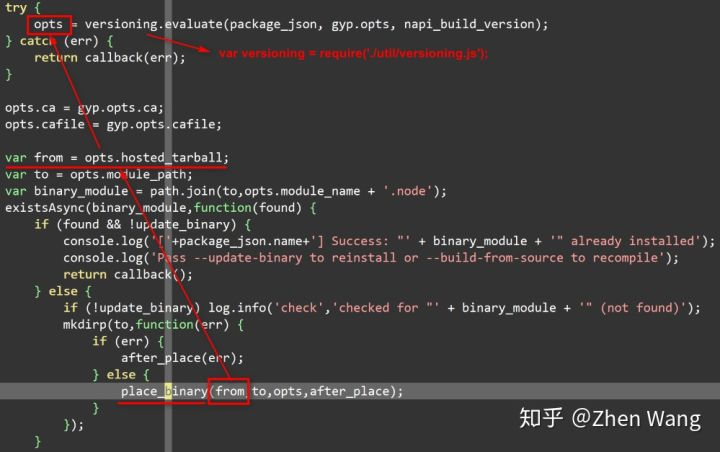

根据流程，接下来我们进一步检查`versioning.js`文件，找到其中的`evaluate`函数，分析最后的`hosted_tarball`路径：

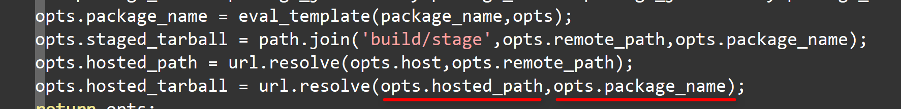

`hosted_tarball`路径主要分为两个部分：1、`hosted_path`；2、`package_name`。

### hosted_path

经过源码分析来源路径为：

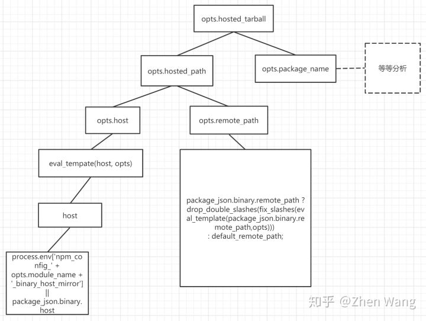

我们自底向上分析。

`host`变量取决于从环境变量中检查名称为`'npm_config_' + opts.module_name + '_binary_host_mirror'`的环境变量。如果不存在，则使用`package_json.binary.host`。正常使用的时候，我们并不会设定环境变量，所以这里就进入`package_json.binary`进行获取。这个`package_json`是`evaluate`函数被调用时候传入的，在`node-pre-gyp/install.js`中能够看到：

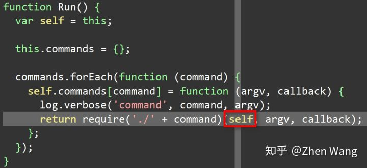

一开始分析的时候，看到这里，本人以为`package_json`就是`node-pre-gyp/package.json`，于是本人去检查该`json`发现很奇怪，并没有 binary 属性，更别提 host 了。一番思考才明白，`node-pre-gyp install`的运行时调用者是谁呀？不是应该是`sqlite3`吗？所以这个地方的`require('./package.json')`实际上是指代的是`sqlite3/package.json`。查看`sqlite3/package.json`，果然发现了对应的元素：

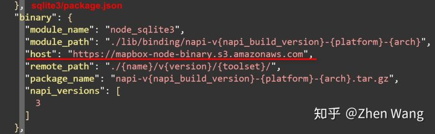

在`binary`属性中，我们还能看到`remote_path`也在其中。

至此，`hosted_path`我们完成了简单的分析，我们可以得出一个结论：

**`node-pre-gyp`下载二进制文件的路径，优先来源于对应模块的镜像地址，该镜像地址通过配置`'npm_config_' + 模块名 + '_binary_host_mirror'`来实现自定义；在没有定义镜像地址的情况下，读取模块`package.json`中的 binary 属性信息。**

当然，读者可以根据具体情况再进一步分析源码。

### package_name

其实，对于`hosted_path`的分析，我们也容易分析`package_name`了。

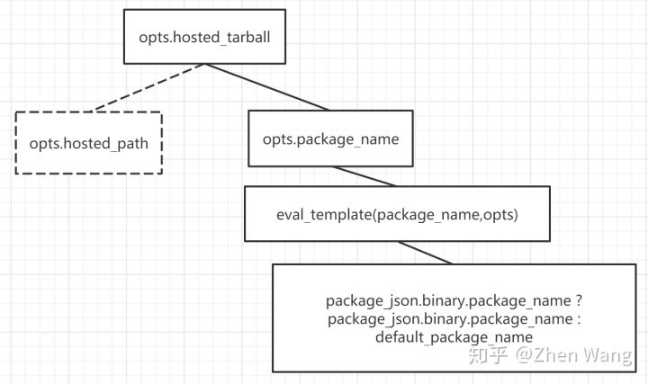

自底向上分析，来自于`sqlite3/package.json`中`binary`属性中的`package_name`，内容见上图分析`host`。

### 失败处理

`--fallback-to-build`参数表明了是否进行失败后下载源码进行编译，源码不再分析。

### 从源码构建

### build.js

当我们提供了参数`--build-from-source`或是在下载编译好的二进制到本地出错的时提供了参数`--fallback-to-build`。node-pre-gyp 将进入`do_build`模块，进行源码编译。

```text
function do_build(gyp,argv,callback) {
  var args = ['rebuild'].concat(argv);
  gyp.todo.push( { name: 'build', args: args } );
  process.nextTick(callback);
}
```

代码中，`gyp`由调用 install 的时候，传入：

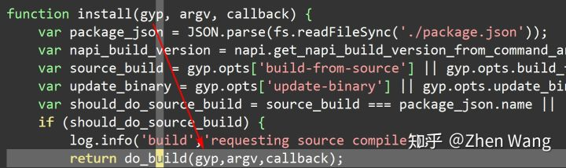

那么我们又将回到调用 install 的地方。实际上，gyp 就是 node-pre-gyp.js 导出的模块：

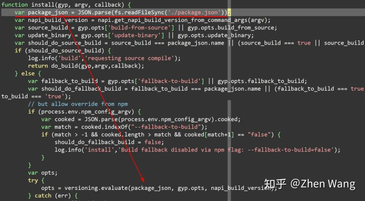

也就是说在`do_build`中进行操作就是，放置了一个`build`任务在队列中。所以我们按照先前的分析，直接去看`build.js`

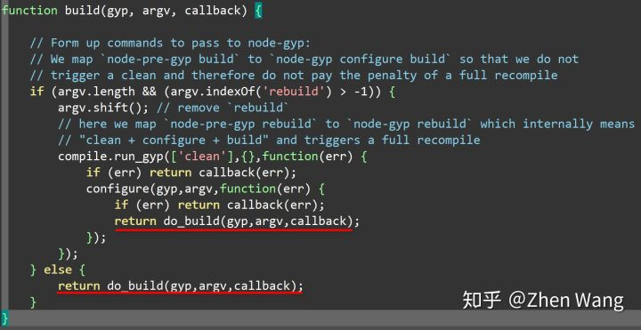

看源码调用了当前模块中的`do_build`，且其中最核心的就是`compile`模块：

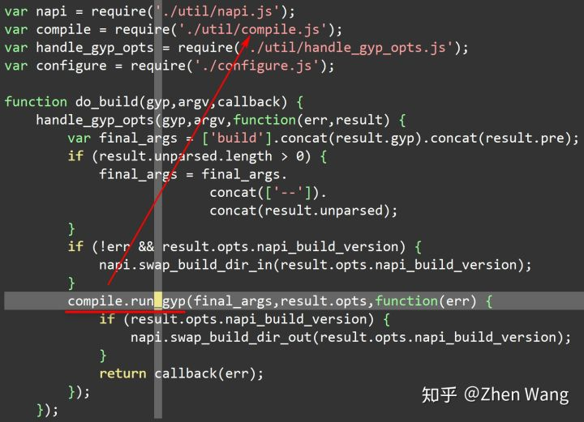

### util/compile.js

进入 compile 模块，直接找到对应的`run_gyp`函数，代码很短，不难看出进行构建调用了`node-gyp`

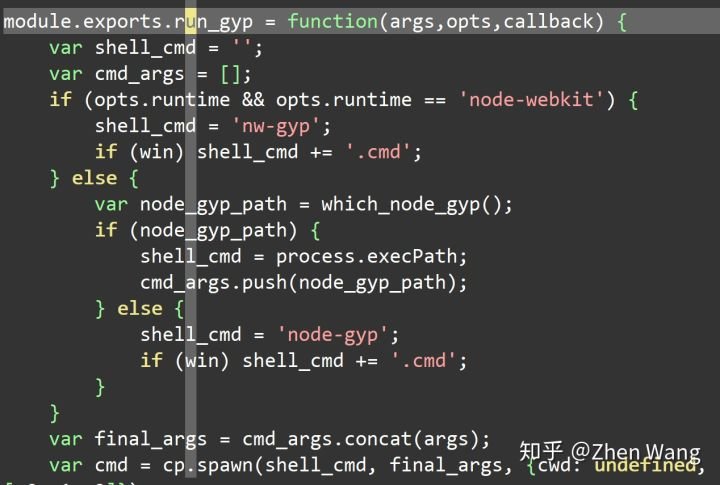

上述代码，会先考略`node-webkit`构建。但是我们核心的还是使用`node-gyp`，所以 else 中，会进行`node-gyp`的工具的检查工作。最后调用命令行执行`node-gyp`。于是，node 原生模块的安装工作，进入了新的阶段：`node-gyp`。

## `node-gyp build`

上文提到我们已经进入了`node-gyp`的范畴，会调用`node-gyp build`操作。当然，这个命令同样是在安装`node-gyp`依赖的时候已经完成了安装，并且进行`node_modules/.bin/`软连接操作。

```js
...
  "bin": {
    "node-gyp": "bin/node-gyp.js"
  },
  ...
```

我们进入该`js`进行分析

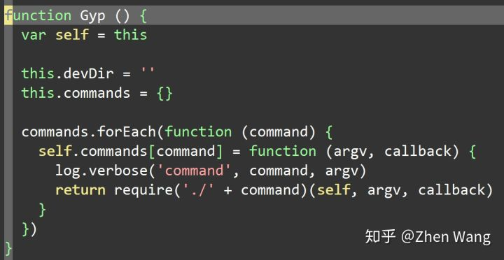

实际上，`node-gyp`这段的命令行代码，和`node-pre-gyp`非常相似！所以我们也不去深入分析调用命令行了。直接在 lib 文件夹下面的`build.js`。在该`js`中，核心的方法为：

```js
function build (gyp, argv, callback) {
    ...
}
```

在该方法中，还编写了几个**内部函数**，作为了功能的划分：

```js
// function build (gyp, argv, callback) 内部函数
    /**
   * Load the "config.gypi" file that was generated during "configure".
   */
  function loadConfigGypi () {...}
    /**
   * On Windows, find the first build/*.sln file.
   */
  function findSolutionFile () {...}
    /**
   * Uses node-which to locate the msbuild / make executable.
   */
  function doWhich () {...}
    /**
   * Search for the location of "msbuild.exe" file on Windows.
   */
  function findMsbuild () {...}
    /**
   * Actually spawn the process and compile the module.
   */
  function doBuild () {...}
  /**
   * Invoked after the make/msbuild command exits.
   */
  function onExit (code, signal) {...}
```

不得不说，`build`写的真心不错，看起来很舒服。这里为了方便读者快速阅读，我整理这些函数的调用图：

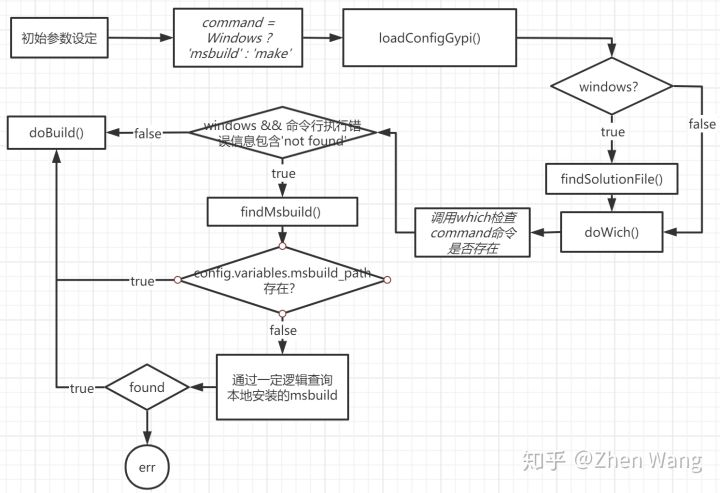

整个调用流程图个人认为足够进行安装的时候的一场分析了。至于每个内部函数的功能，有空继续更新本文吧。
